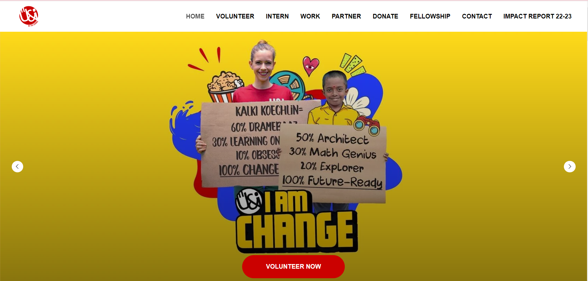
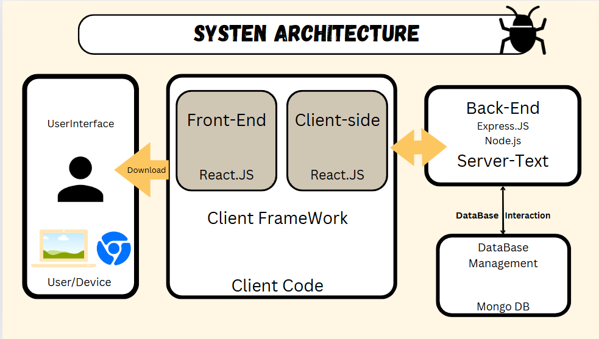
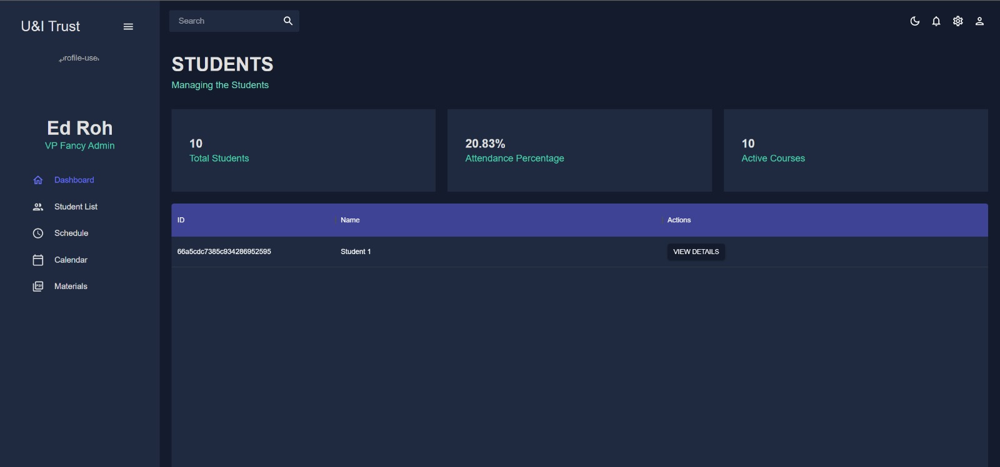
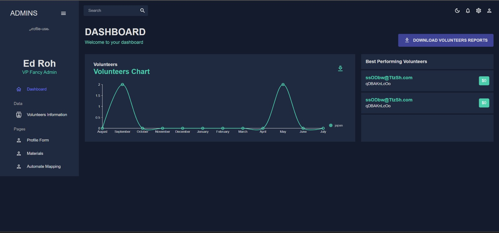
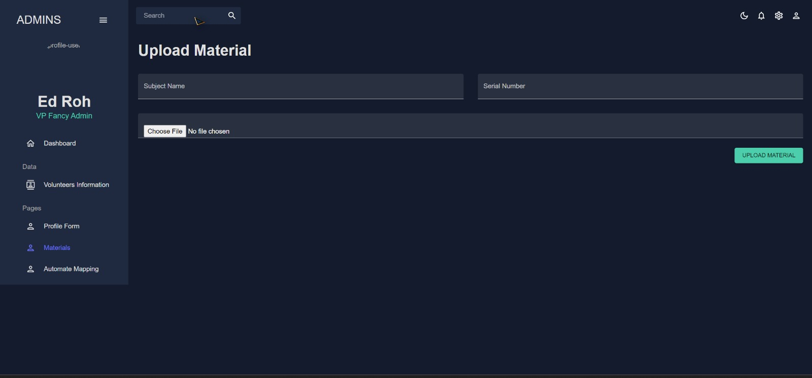
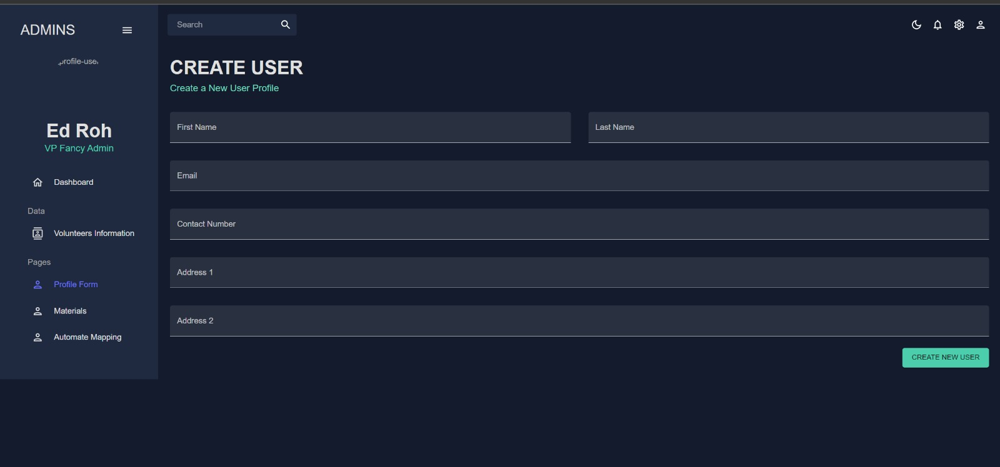
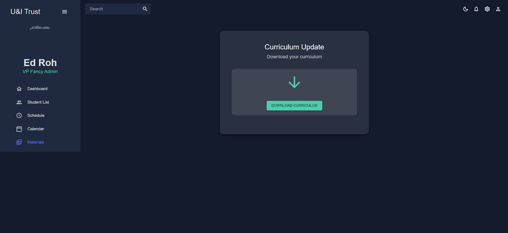
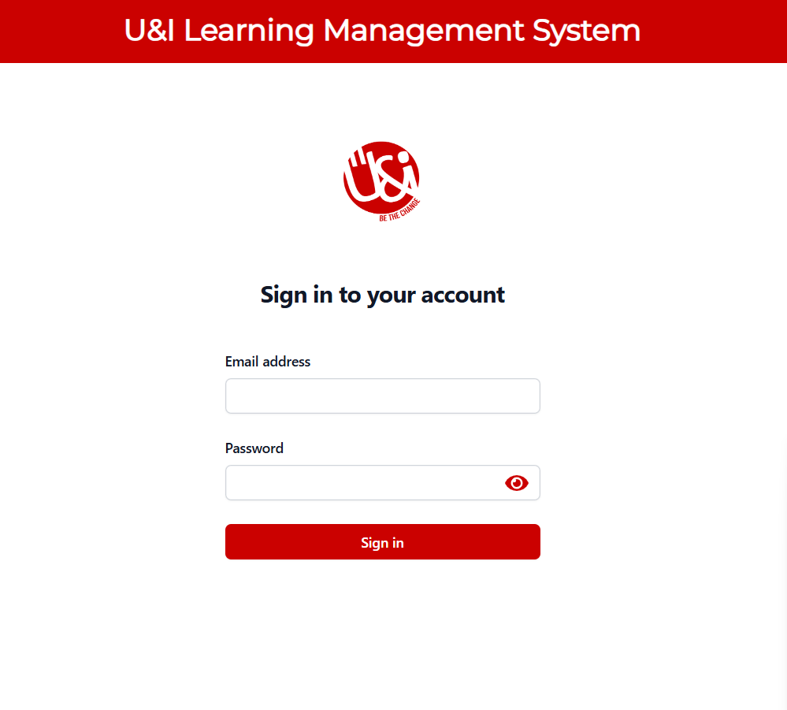

# U&I Volunteer Platform

Welcome to the U&I Volunteer Platform, an initiative for positive social change through civic action and youth leadership. This project is part of **CodeForGood24**.

## Table of Contents
- [About](#about)
- [System Architechitecture](#System-Architechture)
- [Portals](#portals)
  - [Student Portal](#student-portal)
  - [Volunteers Portal](#volunteers-portal)
  - [Learning Circle Leaders](#learning-circle-leaders)
  - [Chapter Leaders](#chapter-leaders)
  - [Managers](#managers)
- [Join Us](#join-us)
- [Contributing](#contributing)
- [License](#license)

## About

U&I is a volunteer-driven charity dedicated to fostering positive social change in marginalized communities through civic engagement and empowering youth leadership movements.
## System Architechitecture

## Portals

### Student Portal

Access learning resources and track your progress through the Student Portal.

### Volunteers Portal

Connect with other volunteers and manage your mentorship activities through the Volunteers Portal.

### Learning Circle Leaders

Coordinate learning circles and ensure high-quality mentorship through the Learning Circle Leaders Portal.

### Chapter Leaders

Manage and support local chapters through the Chapter Leaders Portal.

### Managers

Oversee all activities and ensure program quality through the Managers Portal.

## Join Us

We invite you to join us in making a difference. Visit our [website](http://ec2-54-255-249-50.ap-southeast-1.compute.amazonaws.com:3001/) to learn more about our initiatives and how you can get involved.

## Contributing

We welcome contributions from everyone. If you would like to contribute to this project, please fork the repository and submit a pull request. 

1. Fork the repository.
2. Create a new branch (`git checkout -b feature-branch`).
3. Commit your changes (`git commit -am 'Add new feature'`).
4. Push to the branch (`git push origin feature-branch`).
5. Create a new Pull Request.
## License

This project is licensed under the MIT License. See the [LICENSE](LICENSE) file for details.

---

© 2024 U&I Volunteer Platform. All rights reserved.
